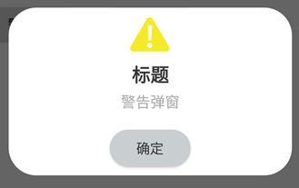

# CommonPopup_SOL
通用弹窗工具类

>提供Android常用弹窗

**效果展示**

基础弹窗


成功弹窗


警告弹窗



错误弹窗


确认弹窗


加载弹窗


带进度的线型加载弹窗


带进度的圆圈加载弹窗


输入弹窗


下拉弹窗


单选弹窗


多选弹窗


引导提示弹窗


单项选择列表滚轮弹窗


时间选择器弹窗


选项选择器弹窗


底部选择弹窗


## 使用方式
### Step 1. Add the JitPack repository to your build file
```
allprojects {
    repositories {
        ...
        maven { url 'https://jitpack.io' }
    }
}
```
### Step 2. Add the dependency
```
dependencies {
        implementation 'com.github.SeedsOfLove:CommonPopup_SOL:1.1.2'
	}
```
### Step 3. Using
```
CommonPopup popup = new CommonPopupImpl(mContext, false);

popup.showBasicDialog();				//基础弹窗

popup.showSuccessDialog();				//成功弹窗

popup.showWarningDialog();				//警告弹窗

popup.showErrorDialog();				//错误弹窗

popup.showConfirmDialog();				//确认弹窗

popup.showLoadDialog();					//加载弹窗

popup.showLineLoadDialogWithValue();	//带进度的线型加载弹窗

popup.showDonutLoadDialogWithValue();	//带进度的圆圈加载弹窗

popup.showEditDialog();					//输入弹窗

popup.showSpinnerDialog();				//下拉弹窗

popup.showSingleChoiceDialog();			//单选弹窗

popup.showMultipleChoiceDialog();		//多选弹窗

popup.showGuidanceTipsDialog();		    //引导提示弹窗

popup.showSingleChoiceWheelDialog();    //单项选择列表滚轮弹窗

popup.showTimePickerWheelDialog();		//时间选择器弹窗

popup.showOptionPickerWheelDialog();	//选项选择器弹窗

popup.showBottomSelectDialog();	        //底部选择弹窗

popup.dialogDismiss();	//弹窗消失
```


